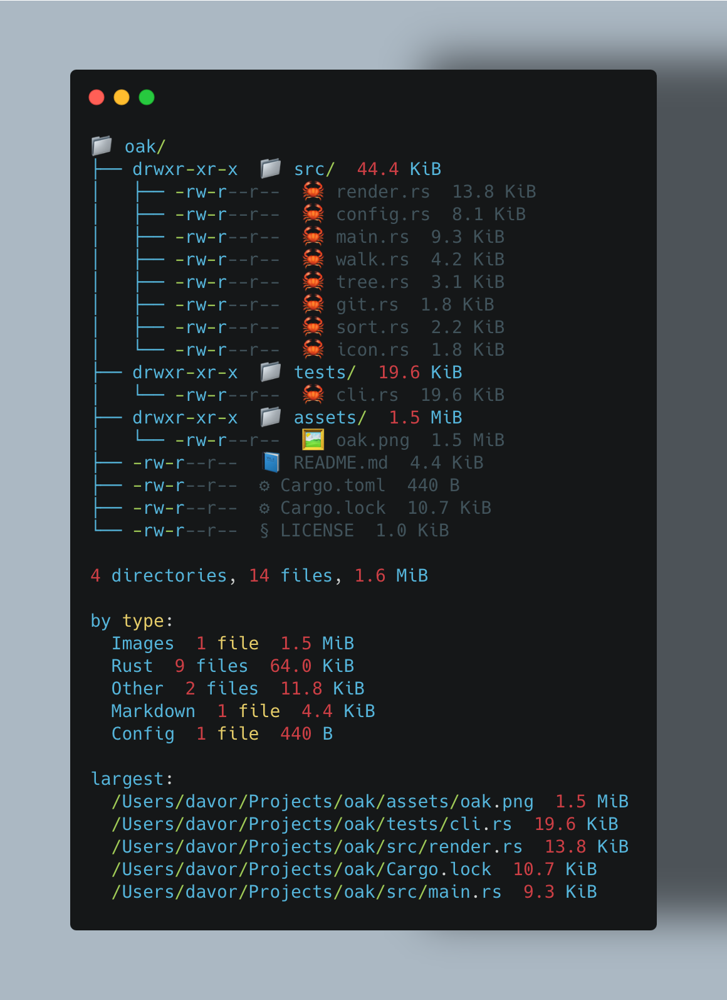

<div align="center" markdown="1">


# Oak

A modern, fast, and beautiful `tree` command.

</div>

---

## Why I Built This

I built Oak as a personal tool to quickly explore datasets, repositories, and multi-project environments. Existing tree utilities were fast, but they did not provide enough context or workflow-focused features for large projects and fast pace scenarios.

The standard `tree` command hasn't evolved in decades. Oak is a ground-up rewrite that makes directory listing actually enjoyable.

- **Git-aware by default** — respects `.gitignore` automatically (no more `node_modules` spam)
- **Rich icons** — macOS-friendly Unicode icons
- **Smart sorting** — sort by name, size, extension, or modification time
- **Useful context by default** — sizes, permissions, stats, symlink targets, git status, pruning, and directory size rollups
- **Timeline mode** — group files and directories by modification recency
- **Clean, colorful output** — modern terminal colors that respect `NO_COLOR`
- **Fast** — built in Rust with parallel gitignore filtering

## Installation

```bash
curl -LsSf https://raw.githubusercontent.com/DavorJordacevic/oak/main/install.sh | sh
```

Or install from source with Cargo:

```bash
cargo install --path .
```

Or copy the binary directly:

```bash
cargo build --release
cp target/release/oak ~/.local/bin/
```

## Usage

```bash
oak                          # current directory
oak -st                      # with sizes and timestamps
oak -L 2                     # max depth 2
oak -a                       # show hidden files
oak -S name                  # sort alphabetically
oak -P '\.rs$'              # filter by regex
oak --find main              # search for files matching name
oak --find-text "hello"       # search file contents for text
oak --clip                   # copy output to clipboard
oak --timeline               # group entries by modification recency
oak -L 2 --no-icons --save-config
```



By default Oak also shows file sizes, permissions, symlink targets, broken link markers, git status, directory size rollups, pruned filter results, and a compact statistics footer.

## Timeline Mode

Timeline mode groups files and directories by modification recency, which makes it easy to see what changed recently in a repository, dataset, or workspace:

```bash
oak --timeline
```

```text
Today:
  src/render.rs  -rw-r--r--  12.9 KiB  M
  README.md      -rw-r--r--   3.8 KiB  M

Last week:
  src/training/

3 months ago:
  legacy/
```

## Find Text Mode

Search file contents and show only matching files with highlighted match locations:

```bash
oak --find-text "TODO"
```

<pre>
oak/
├── src/
│   └── main.rs
└── docs/
    └── guide.md

─── src/main.rs ───
    42 |   // <font color="red">TODO</font>: refactor this
    89 |   // <font color="red">TODO</font>: add tests

─── docs/guide.md ───
    15 | ## <font color="red">TODO</font>
</pre>

- Case-insensitive substring matching
- Shows file path, line number, and matching line content
- Matching text is highlighted in <font color="red">bright red</font> in the terminal
- Respects `--no-color` and `NO_COLOR`
- Progress bar shown during scanning for large trees

## Configuration

Save your preferred options once:

```bash
oak -L 2 -S name --no-icons --save-config
```

Oak writes defaults to:

```text
$XDG_CONFIG_HOME/oak/config
```

If `XDG_CONFIG_HOME` is not set, Oak uses:

```text
~/.config/oak/config
```

Future `oak` runs automatically use the saved defaults. Any flag you pass on a later command overrides the saved value for that setting. Pass `--no-config` to ignore the saved config for one command.

## Sorting

| Flag | Description |
|------|-------------|
| `-S mtime` | **Default** — most recently modified first |
| `-S name` | Alphabetically |
| `-S size` | Largest first |
| `-S ext` | By file extension |

## Options

```
-L, --level <LEVEL>      Maximum display depth
-a, --all                Show hidden files
    --hide-hidden        Hide hidden files
-s, --sizes              Show file sizes
    --no-sizes           Hide file sizes
-t, --times              Show modification times
    --no-times           Hide modification times
    --find <NAME>         Search for files matching name (case-insensitive)
    --find-text <TEXT>    Search file contents for text (case-insensitive)
-P, --pattern <PATTERN>  Only show files matching regex
-I, --exclude <EXCLUDE>  Exclude files matching regex
    --save-config        Save these options as future defaults and exit
    --no-config          Do not read saved config
    --no-ignore          Don't respect .gitignore
    --ignore             Respect .gitignore
    --no-icons           Disable icons
    --icons              Enable icons
    --no-color           Plain text output
    --color              Enable color output
    --dirs-only          Show directories only
    --files-only         Show files only
    --timeline           Show entries grouped by modification recency
    --no-perms           Hide permissions
    --perms              Show permissions
    --no-stats           Hide statistics
    --stats              Show statistics
    --no-links           Hide symlink targets
    --links              Show symlink targets
    --no-prune           Keep empty directories after filtering
    --prune              Prune empty directories after filtering
    --no-du              Hide directory size rollups
    --du                 Show directory size rollups
    --no-git             Hide git status
    --git                Show git status
    --clip                Copy output to clipboard
-S, --sort <SORT>        Sort order (mtime, name, size, ext)
```

## License

MIT - See [LICENSE](LICENSE).
